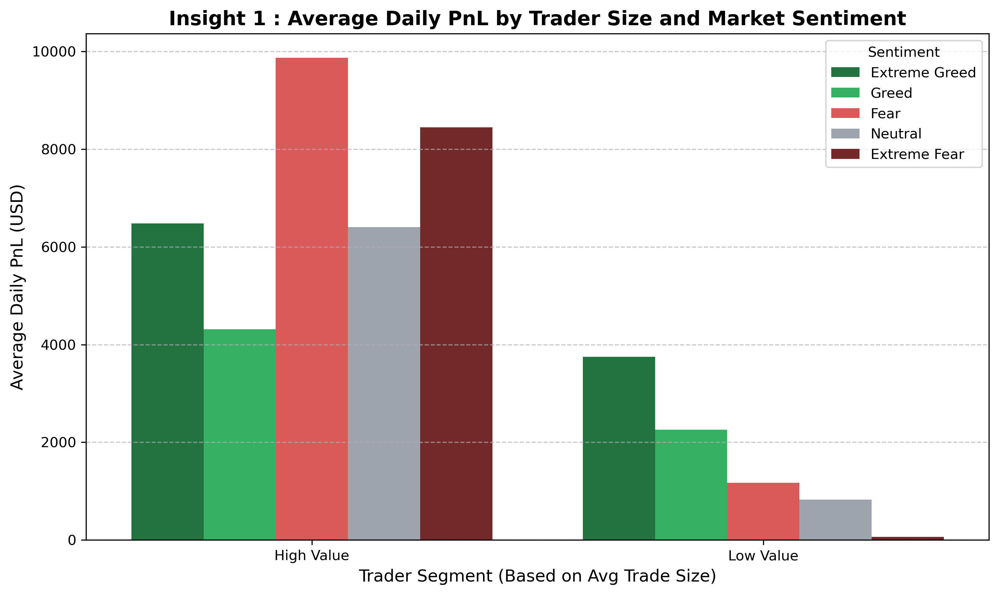
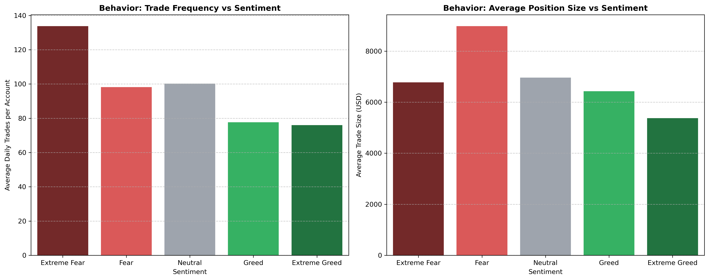
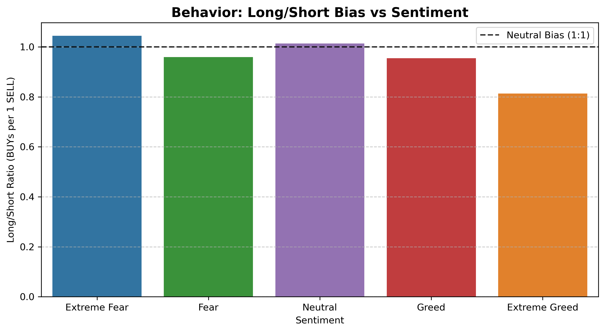
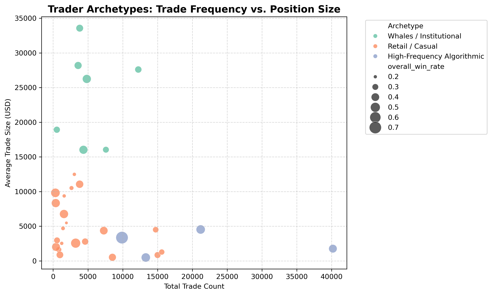

# Primetrade.ai — Trader Performance vs. Market Sentiment

**Candidate:** Chinmay D M &nbsp;|&nbsp; **Role:** Data Science / Analytics Intern


---

## Executive Summary

This analysis uncovers a **structurally contrarian trading ecosystem** on Hyperliquid. High-value accounts operate as informal liquidity providers during market panic (**Extreme Fear**), capturing significant upside by absorbing retail liquidations. Conversely, retail accounts suffer heavy drawdowns during volatility and rely entirely on upward momentum during **Extreme Greed** to achieve profitability.

Two data-driven strategies are proposed: one to **protect retail capital** through sentiment-aware risk guardrails, and one to **incentivize whale liquidity provision** via dynamic fee structures.

---

## Dataset Overview

| Dataset | Rows | Columns | Quality |
|---|---|---|---|
| Hyperliquid Historical Trades | 211,224 | 16 | ✅ 0 nulls, 0 duplicates |
| Bitcoin Fear/Greed Index | 2,644 | 4 | ✅ 0 nulls, 0 duplicates |
| **Daily Trader Summaries (engineered)** | **2,340** | **7** | — |

---

## Key Insights

### 1. Divergent Profitability — Fear vs. Greed

> **High-value (whale) accounts achieve their highest PnL during Fear. Retail accounts only profit during Extreme Greed.**

Whales exploit retail panic liquidations via mean-reversion strategies. Retail traders are momentum-dependent — they need the market going up to make money.



---

### 2. Extreme Fear Drives Peak Trading Activity

> **Trade frequency peaks during Extreme Fear (~135 avg daily trades) — the opposite of what you'd expect.**

Contrary to the assumption that Greed causes overtrading, Extreme Fear triggers high-frequency execution — likely algorithmic adjustments or retail stop-loss churn. Position sizes also spike during Fear, pointing to large capital stepping in to absorb the sell-off.



---

### 3. Traders Are Structurally Contrarian

> **The Long/Short ratio peaks above 1.0 during Extreme Fear and drops to ~0.8 during Extreme Greed.**

The trader base systematically buys into maximum panic and shorts into peak euphoria. This contrarian bias is statistically consistent across the full dataset period.



---

## Strategy Recommendations

### Strategy 1 — The Retail Momentum & Protection Rule
**Target Segment:** Low-Value Accounts (Retail / Momentum Traders)

*"During Fear/Extreme Fear days, reduce trade frequency and position sizing — avoid catching falling knives. During Greed/Extreme Greed, scale up to capture momentum; this is the only environment where retail demonstrates statistical edge."*

**Platform application:** Surface a **"High Volatility Warning"** UI prompt for accounts under a capital threshold during Extreme Fear, with an optional leverage cap to prevent liquidation cascades and protect platform retention.

---

### Strategy 2 — The Whale Liquidity Provision Rule
**Target Segment:** High-Value Accounts (Whales / Institutional)

*"Scale into Long positions during Extreme Fear to provide liquidity against retail panic selling. Aggressively reduce Long exposure and increase Short bias during Extreme Greed to fade retail euphoria."*

**Platform application:** Implement **dynamic maker-fee rebates** specifically during Extreme Fear conditions — incentivizing institutional participation that stabilizes platform liquidity.

---

## Bonus — Behavioral Clustering (Trader Archetypes)

K-Means (k=3) on scaled features `(total_trades, avg_trade_size, win_rate)` identifies three distinct archetypes. Labels were assigned **after inspecting cluster centroids**, not by arbitrary cluster ID.

| Archetype | Characteristics |
|---|---|
| 🟢 Retail / Casual | Low trade count, small position sizes, variable win rate |
| 🟡 High-Frequency Algorithmic | Very high trade count, moderate position sizes |
| 🔴 Whales / Institutional | Low-to-moderate trade count, very large positions |



---

## Methodology

| Step | What was done |
|---|---|
| **01 — Data Ingestion** | Loaded both datasets. Verified 0 nulls and 0 duplicates. Documented shape and column types. |
| **02 — Temporal Alignment** | Parsed `Timestamp IST` strings and sentiment `date` column to `datetime.date`. Applied a daily-level left join. |
| **03 — Feature Engineering** | Aggregated 211k rows into 2,340 daily per-trader summaries: `daily_PnL`, `trade_count`, `win_rate`, `avg_trade_size_usd`, `daily_fees`. |
| **04 — Segmentation** | Median-split into High/Low Value and Frequent/Infrequent traders for comparative analysis. |
| **05 — Clustering** | K-Means (k=3) with StandardScaler. Centroids inspected before archetype labels assigned. |

---

## Repository Structure

```
./
├── analysis.ipynb              ← main notebook: all analysis, charts, insights
├── requirements.txt            ← pinned Python dependencies
├── README.md
├── data/
│   ├── fear_greed_index.csv    ← Bitcoin Market Sentiment dataset
│   └── historical_data.csv     ← Hyperliquid historical trader data
└── images/
    ├── insight1_pnl_by_sentiment.png
    ├── insight2_behavioral_shifts.png
    ├── insight3_long_short_bias.png
    └── bonus_trader_archetypes.png
```

---

## Quick Start

**1. Clone the repo**
```bash
git clone https://github.com/Chinmay9535/-Primetrade.ai-round-0
cd Primetrade.ai-round-0
```

**2. Install dependencies**
```bash
pip install -r requirements.txt
```

**3. Add the datasets**

Place `fear_greed_index.csv` and `historical_data.csv` inside the `data/` folder.

**4. Run the notebook**
```bash
jupyter notebook analysis.ipynb
```

---

*Submitted as part of the Data Science / Analytics Intern hiring process at Primetrade.ai*
